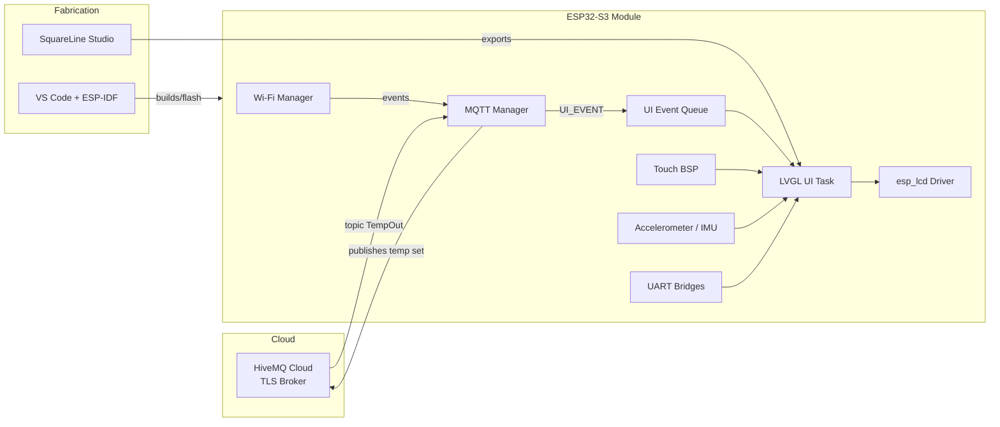

# Prototype Steering-Wheel Auxiliary Display System

This document captures the intent, design decisions, and integration details for the ESP32 S3‑based auxiliary display prototype. It is meant to help reviewers understand the maturity of the work and to serve as a hand‑off document for future iterations.

## 1. Concept And Constraints

**Vision.** Deliver a drop‑in auxiliary display for premium vehicles that augments a steering wheel with a high‑resolution AMOLED, multi‑touch interaction, and contextual vehicle telemetry. The prototype demonstrates that an embedded SoC can host a responsive, automotive‑grade UI while remaining OTA‑updatable and telematics ready.

**Key capabilities**

- 466×466 circular AMOLED with full‑frame LVGL animations and SquareLine layouts
- Multi‑touch interaction and swipe navigation across HVAC, media, and settings panes
- ESP32‑S3 (dual Xtensa LX7, integrated USB, abundant PSRAM) as the primary compute node
- On‑board sensors (IMU/accelerometer) to support gesture and vehicle‑state awareness
- Wi‑Fi + MQTT connectivity for cloud‑based telemetry and OTA control
- UART headers for integration with existing vehicle CAN gateways or diagnostics

**Primary constraints**

- Must fit within steering‑wheel spokes and share power with existing accessory rails
- Boot‑to‑interactive target < 5 s, with OEM splash/fade‑in for perceived quality
- Rapid iteration is critical, so the UX workflow needs low code churn (SquareLine + VS Code)

## 2. Design Considerations

| Topic | Decision | Rationale |
| --- | --- | --- |
| Display technology | AMOLED (SH8601/GC9B71 class) | High contrast, suits round layout, supports 60 FPS over QSPI |
| Processor | ESP32‑S3 | Native USB, large PSRAM (8 MB) for LVGL buffers, hardware crypto for TLS |
| Touch | Capacitive multi‑touch (FT3168) | Already supported via ESP-IDF drivers, allows gestures |
| Networking | Wi‑Fi STA + MQTT over TLS | Simplifies prototyping while keeping cloud connectivity realistic |
| Tooling | ESP-IDF + VS Code + SquareLine | Maintainable CMake flow with modern UI prototyping |
| Safety | Task watchdog & LVGL mutexing | Prevents UI stalls, meets automotive responsiveness expectations |

## 3. System Architecture

**Data Flow.** UI components publish MQTT button events (media + HVAC) while the broker feeds back `TempOut` telemetry. The `mqtt_manager` normalizes inbound payloads, pushes them into an LVGL-safe queue, and the HVAC screen updates its `TempOut` label plus center temperature readout. Wi‑Fi and MQTT status indicators reuse the same queue to keep all rendering in the LVGL task context.

## 4. Hardware Stack

| Subsystem | Notes |
| --- | --- |
| **ESP32‑S3 MCU** | Custom carrier with 8 MB Octal PSRAM & 4 MB QSPI flash. USB‑C for flashing + serial, spare UART headers for vehicle integration. |
| **Display** | 1.78" 466×466 circular AMOLED (SH8601 driver). Driven via QSPI at 80 MHz with `esp_lcd_sh8601` component. |
| **Touch** | FT3168 capacitive controller on I²C, interrupt-driven to minimize latency. |
| **Sensors** | 6‑axis IMU (e.g., Bosch BMI270) tied to I²C. Used for orientation compensation and gesture research. |
| **Power** | 5 V accessory input, bucked to 3.3 V. Backlight and touch rails individually switchable for sleep. |
| **Connectivity** | ESP32 native Wi‑Fi, optional BLE for pairing. Wi‑Fi credentials persisted via `wifi_manager`. |
| **External Interfaces** | Dual UART mezzanine connectors for CAN/diagnostic bridges, plus a general GPIO header for experimentation. |

### Block-Level Schematic (Textual)

- **Power rail:** 5 V → buck regulator → 3.3 V plane feeding ESP32‑S3, AMOLED, touch, accelerometer.
- **QSPI display:** ESP32 GPIO[9..14,21] connected to SH8601 data lanes + reset/backlight MOSFET.
- **I²C bus:** Shared between touch, IMU, and future peripherals; pull-ups sized for 400 kHz.
- **UART0:** Routed to USB/JTAG bridge for development; UART1/2 exposed via JST headers.
- **User inputs:** Multi-touch gestures plus optional capacitive buttons on spare pads.

## 5. Firmware Modules

| Module | Purpose | Key Files |
| --- | --- | --- |
| **LVGL UI** | Screen orchestration, SquareLine assets, splash sequencing, gesture navigation. | `main/example_qspi_with_ram.c`, `main/ui/*` |
| **Splash + Navigation** | Branded 4‑second fade-in/out splash (Screen4), registered screen order (HVAC → Music → Intensity → Settings). | `example_qspi_with_ram.c` |
| **Wi-Fi Manager** | Credential storage, status callbacks, integration with UI events. | `components/wifi_manager/*` |
| **MQTT Manager** | TLS connection to HiveMQ Cloud (ISRG Root X1), button telemetry publish, TempOut subscription. | `components/mqtt_manager/*` |
| **Touch & LCD BSP** | Panel detection, LVGL flush, FT3168 driver hookups. | `components/touch_bsp`, `components/read_lcd_id_bsp`, `main/example_qspi_with_ram.c` |
| **Queues & Watchdogs** | UI event queue decouples ISR/network events from LVGL task, watchdog handled within `example_lvgl_port_task`. | `main/example_qspi_with_ram.c` |

## 6. Toolchain & Workflow

1. **IDF Environment.** ESP-IDF 6.1 with component manager. VS Code tasks invoke `idf.py build flash monitor`.
2. **UI Authoring.** SquareLine Studio (v1.5.x) produces `ui_Screen*.c/h` assets. Generated code is staged in `main/ui/` and wrapped with LVGL 8 conventions.
3. **Rapid Iteration.** Splash screen and HVAC slider logic stay centralized in `example_qspi_with_ram.c`, so state machines remain C-native.
4. **TLS Credentials.** HiveMQ Root CA embedded in `mqtt_manager`. Username/password currently static (dev credentials), but the module supports menuconfig overrides for production.
5. **Testing.** `idf.py monitor` used for runtime logs. MQTT broker instrumentation done via HiveMQ Cloud dashboard.

### VS Code Tips

- Use the ESP-IDF extension for menuconfig, flash, and monitor integration.
- Tasks are pre-configured (`idf.py build flash monitor`) for one-click deploy.
- CMake presets are not required; ESP-IDF’s environment handles target selection.

### SquareLine Integration

- Import the `.slt` project stored in `main/ui/` to tweak UI layouts.
- After exporting, run `idf.py build` to regenerate LVGL assets.
- Keep LVGL version pinned (8.3.x) in SquareLine to avoid API drift.

## 7. Future Enhancements

- **Vehicle bus bridge:** Map UART telemetry to CAN/CAN-FD for production harnesses.
- **Accelerometer UX:** Use sensor fusion to animate UI based on steering angle or vibration.
- **OTA + provisioning:** Add BLE or SoftAP onboarding plus signed firmware updates.
- **Diagnostics UI:** Display sensor health, network status, debug logs accessible via a hidden swipe.
- **Hardened credentials:** Move MQTT username/password to encrypted NVS and support fleet provisioning.

## 8. References

- ESP-IDF docs: [https://docs.espressif.com/projects/esp-idf/en/latest/](https://docs.espressif.com/projects/esp-idf/en/latest/)
- LVGL porting guide: [https://docs.lvgl.io/master/porting](https://docs.lvgl.io/master/porting)
- SquareLine Studio: [https://squareline.io](https://squareline.io)
- HiveMQ Cloud TLS guidance: [https://www.hivemq.com/docs/cloud](https://www.hivemq.com/docs/cloud)

---

Prepared by the Embedded UX Prototyping Team  
Revision: 2025‑12‑15
